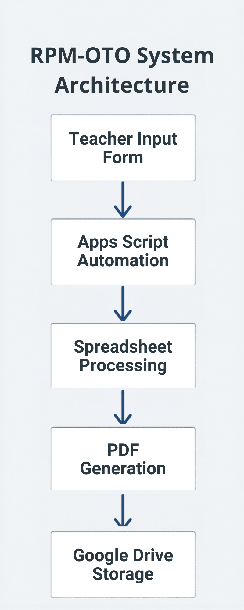
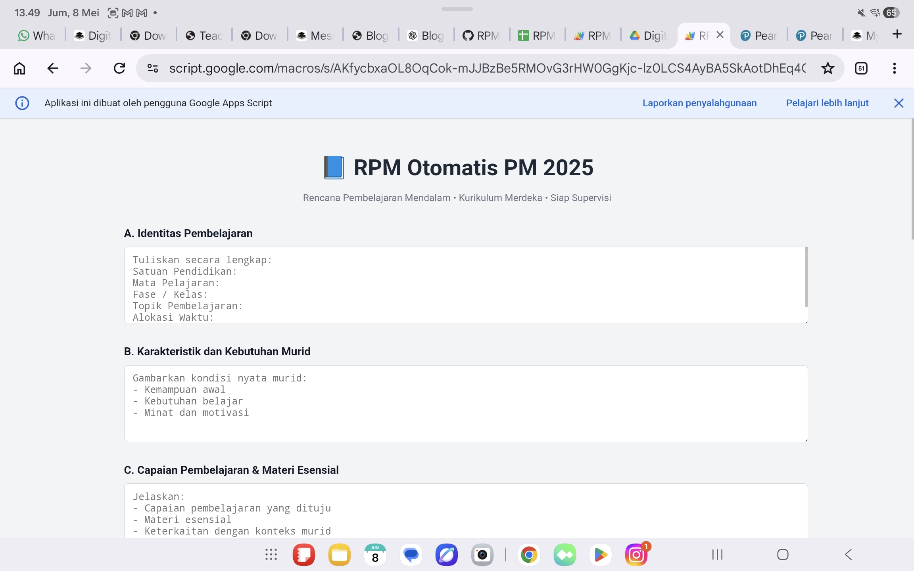
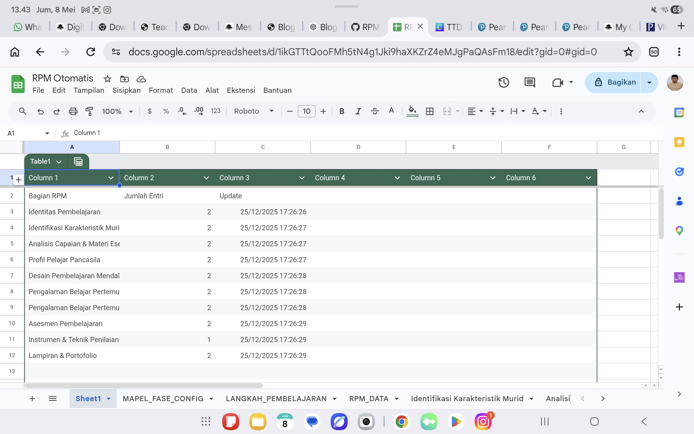
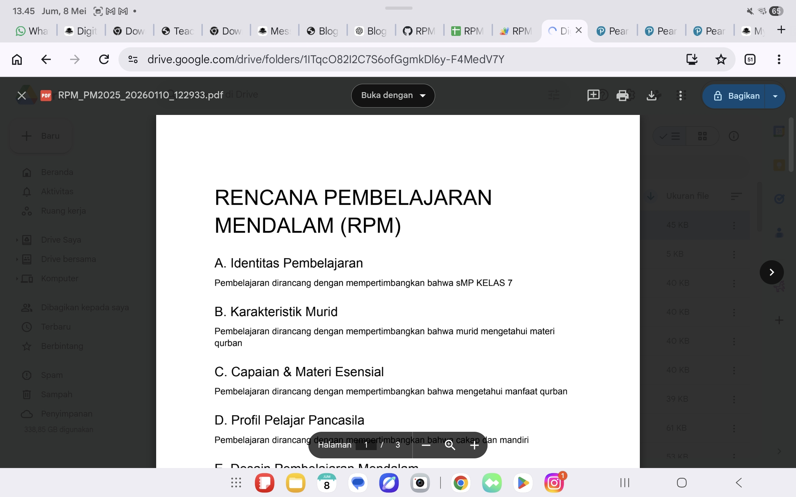
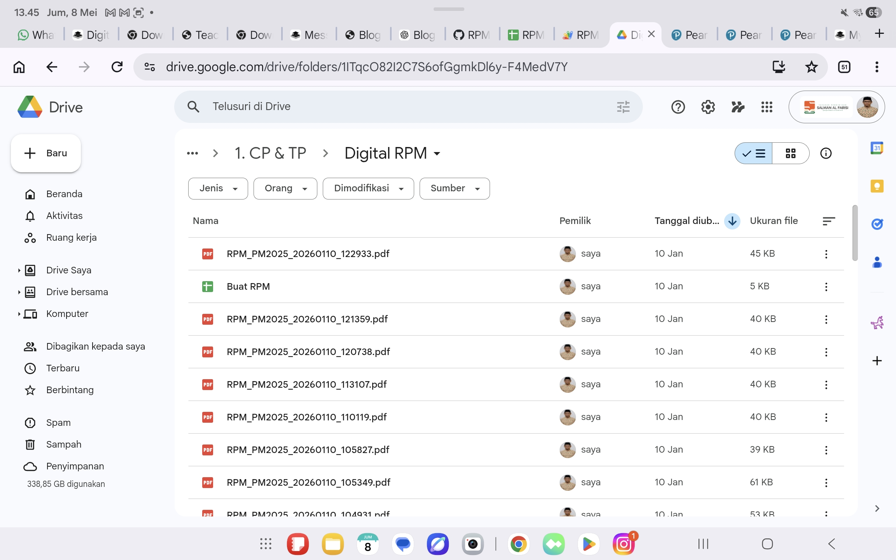

# RPM-OTO — Educational Reporting Automation System

> AI-Assisted Educational Reporting Automation System built to reduce teacher administrative workload through Google Workspace automation.

RPM-OTO is an educational automation platform designed to simplify reporting workflows and document generation using Google Forms, Google Sheets, Google Apps Script, Google Drive, and automated PDF generation.

The system transforms structured teacher input into standardized reports automatically, helping educators spend less time on administration and more time supporting student learning.

---

# 🚀 Why RPM-OTO?

Teachers often spend significant time preparing, formatting, organizing, and managing educational reports.

RPM-OTO addresses this challenge by automating the entire reporting workflow:

Teacher Input
↓
Data Processing
↓
Apps Script Automation
↓
PDF Generation
↓
Google Drive Storage

The result is a faster, more consistent, and scalable reporting process.

---

# 🎯 Educational Impact

RPM-OTO was created with a simple goal:

> Reduce administrative workload so teachers can focus on teaching and learning.

Benefits include:

* Reduced repetitive administrative tasks
* Faster report generation
* Consistent reporting standards
* Automated document organization
* Improved operational efficiency
* Better use of teacher time

---

# ⚙️ Core Features

* Automated RPM document generation
* Google Forms integration
* Google Sheets database workflow
* Google Apps Script automation engine
* PDF report generation
* Google Drive file management
* Standardized reporting structure
* Teacher-friendly workflow
* Low-cost implementation using Google Workspace
* Scalable educational reporting system

---

# 🏗️ System Architecture



---

# 📸 System Preview

## Form Input

Structured teacher input through Google Forms.



---

## Spreadsheet Processing

Workflow management and reporting database using Google Sheets.



---

## Automated PDF Generation

Educational reports generated automatically in PDF format.



---

## Google Drive Storage

Generated files are automatically organized and stored.



---

# 🏫 Real Classroom Implementation

RPM-OTO is not a prototype.

It is designed and tested for real educational reporting workflows.

### Before Automation

* Manual document formatting
* Repetitive administrative work
* Inconsistent report structures
* Time-consuming file management
* Increased teacher workload

### After Automation

* Faster report creation
* Standardized documentation
* Organized file storage
* Reduced administrative burden
* More time for instruction and student support

---

# 🛠️ Technology Stack

### Backend Automation

* Google Apps Script

### Data Layer

* Google Sheets

### Storage Layer

* Google Drive

### Input Layer

* Google Forms

### Frontend

* HTML
* CSS
* JavaScript

### Deployment

* Vercel

---

# 📂 Repository Structure

```text
RPM-OTO/
│
├── assets/
│   ├── architecture-diagram.png
│   ├── form-input.png
│   ├── spreadsheet-workflow.png
│   ├── generated-pdf.png
│   └── drive-storage.png
│
├── docs/
│
├── src/
│
├── README.md
└── SYSTEM-OVERVIEW.md
```

---

# 🔮 Future Roadmap

Planned improvements:

* Multi-user authentication
* Dashboard analytics
* AI-assisted reporting support
* DOCX export
* Classroom activity tracking
* Student learning analytics
* Reflection analytics
* Character development reporting
* Human-Centered Learning Ecosystem integration

---

# 📄 Documentation

Additional documentation:

* SYSTEM-OVERVIEW.md

---

# 👤 Author

**Rendi Nur Holis**

English Educator | Educational Technology Innovator | Educational Systems Builder

Focused on:

* Educational Automation
* Artificial Intelligence in Education
* Character Formation
* Reflection-Based Learning
* Human-Centered Learning Ecosystem Design

---

## Vision

Building educational systems that combine:

* Character Formation
* Reflection
* Project-Based Learning
* AI Integration
* Educational Automation

to create meaningful and sustainable learning experiences.
